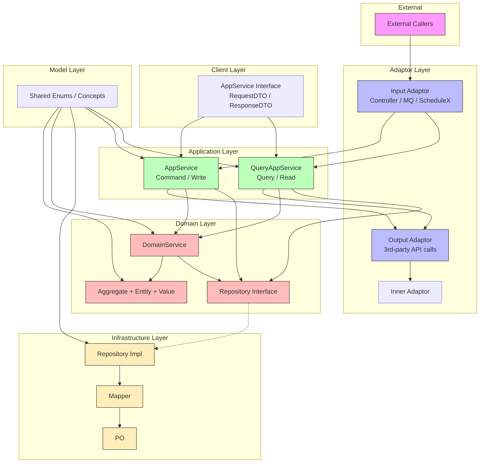
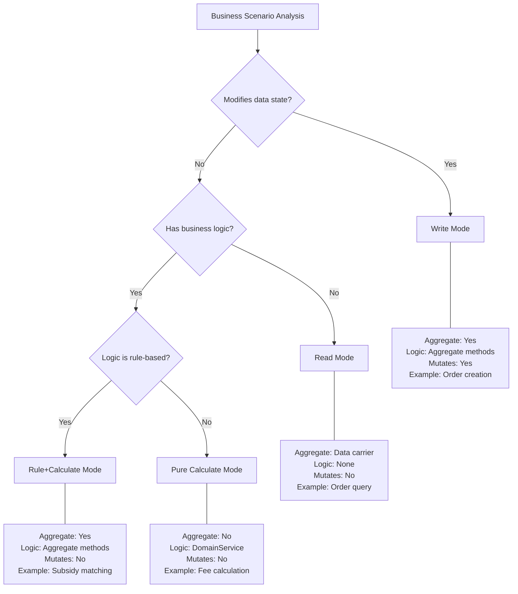
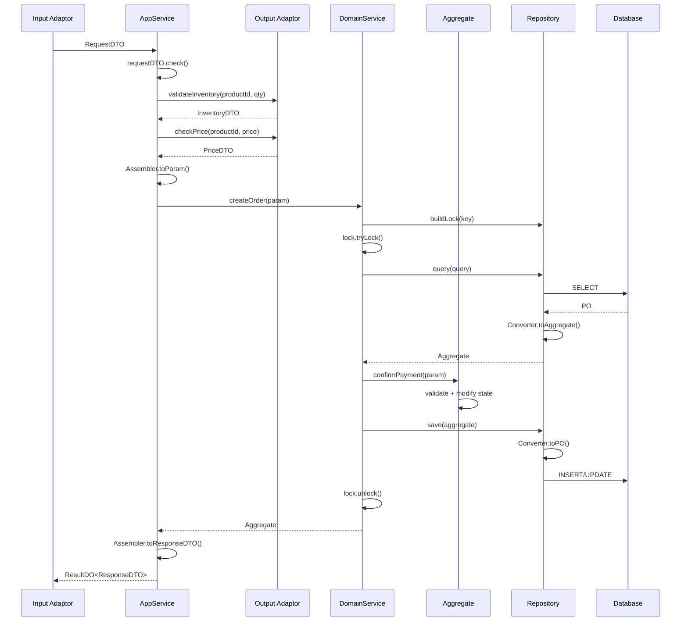
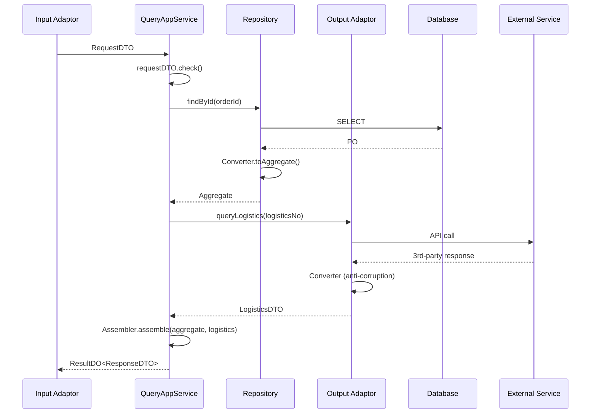
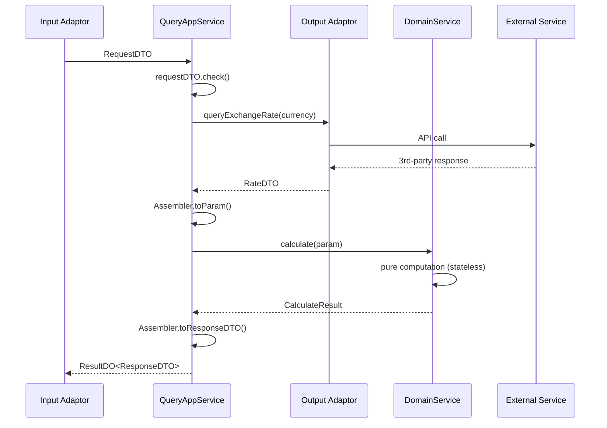
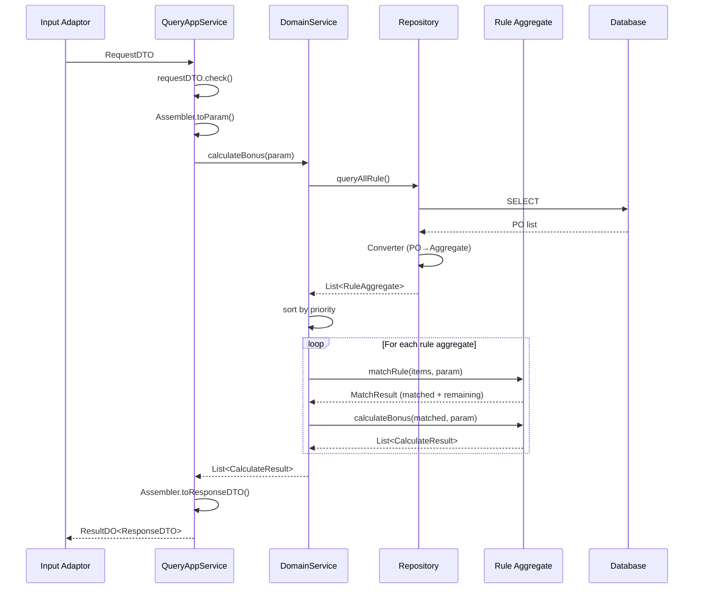

# DDD Architecture Overview


## 目录
- [1. Hexagonal Architecture — Core Design Principles](#1-hexagonal-architecture-—-core-design-principles)
  - [1.1 Layer Dependency Rules](#11-layer-dependency-rules)
  - [1.2 Domain Layer Isolation](#12-domain-layer-isolation)
- [2. Project Structure](#2-project-structure)
- [3. Four DDD Development Modes](#3-four-ddd-development-modes)
  - [3.1 Mode Comparison](#31-mode-comparison)
  - [3.2 Mode Selection Decision Tree](#32-mode-selection-decision-tree)
  - [3.3 Call Chain Sequence Diagrams](#33-call-chain-sequence-diagrams)
- [4. Spec File Usage by Mode](#4-spec-file-usage-by-mode)
  - [4.1 Write Mode — Required Specs](#41-write-mode-—-required-specs)
  - [4.2 Read Mode — Required Specs](#42-read-mode-—-required-specs)
  - [4.3 Pure Calculate Mode — Required Specs](#43-pure-calculate-mode-—-required-specs)
  - [4.4 Rule+Calculate Mode — Required Specs](#44-rule+calculate-mode-—-required-specs)
- [5. Document Index](#5-document-index)

## 1. Hexagonal Architecture — Core Design Principles

### 1.1 Layer Dependency Rules

**Call order** (outside → inside):

```
inAdaptor → Application → Domain → Repository (DB/Cache/Message)
                                 → outAdaptor (external 3rd-party services)
```

> Repository handles intra-domain data operations (DB, cache, messaging). Adaptor handles cross-domain external service calls. Repository does NOT depend on Adaptor.

**Dependency rules** (via dependency inversion):

| Layer | Depends On | Notes |
|-------|-----------|-------|
| **Adaptor** (`inAdaptor`/`outAdaptor`) | `application` interfaces | Implements interfaces defined by Application layer |
| **Application** | `domain`, `client`, `model` | Orchestration layer |
| **Infrastructure** | `domain`, `model` | Implements Repository interfaces defined by Domain layer |
| **Domain** | `model` only | Pure business logic, zero framework dependencies (Spring and static utils excepted) |
| **Client** | nothing internal | External RPC API surface; **forbidden** from depending on `model` layer — DTOs must be self-contained |
| **Model** | nothing | Shared enums, common business concepts; usable by `domain`, `application`, `adaptor`, `infrastructure` |

Key: All internal modules ultimately depend on the Domain layer. Technical details are separated from business logic.



### 1.2 Domain Layer Isolation

- Domain layer contains **only pure business code**
- Forbidden: direct framework/library references (Spring and static utility packages excepted)
- Technical implementations (DB, API calls) are abstracted behind interfaces, with concrete implementations in outer layers

---

## 2. Project Structure

```
com.example
├── domain/                          # Domain layer
│   └── {business}/                  # e.g., order, booking, refund
│       ├── model/
│       │   ├── aggregate/           # Aggregate roots
│       │   ├── entity/              # Entities
│       │   ├── value/               # Value objects
│       │   ├── param/               # Parameter objects (extends BaseParam)
│       │   └── result/              # Result objects (extends BaseResult)
│       ├── service/                 # Domain services
│       └── repository/              # Repository interfaces
├── application/                     # Application layer
│   └── {business}/
│       ├── scenario/                # Scene orchestration (AppService impls)
│       └── assembler/               # DTO ↔ Domain object mapping
├── client/                          # External API definitions
│   └── {business}/
│       ├── enums/                   # Client-side enums
│       ├── model/                   # Shared nested DTOs (extends BaseDTO)
│       ├── req/                     # Request DTOs (extends BaseDTO)
│       └── res/                     # Response DTOs (extends BaseDTO)
├── model/                           # Internal shared models
│   └── ...                          # Shared enums, common business concepts
├── infrastructure/                  # Infrastructure layer
│   └── {business}/
│       ├── repository/              # Repository implementations
│       ├── mysql/
│       │   ├── po/                  # Persistent Objects
│       │   └── mapper/              # MyBatis Mapper interfaces
│       └── converter/               # Aggregate ↔ PO converters
└── adaptor/                         # Anti-corruption layer
    └── {business}/
        ├── input/                   # Input adaptors (Controller, MQ consumer, scheduled tasks)
        ├── output/                  # Output adaptors (external service calls)
        └── inner/                   # Internal shared adaptors
```

---

## 3. Four DDD Development Modes

### 3.1 Mode Comparison

| Mode | Aggregate/Entity | Business Logic Location | Mutates State | Typical Scenario |
|------|------------------|------------------------|---------------|------------------|
| **Write** | Yes | Aggregate/Entity methods | Yes | Order creation, status changes |
| **Read** | Yes (data carrier only) | None (data transformation only) | No | Order queries |
| **Rule+Calculate** | Yes | Aggregate/Entity methods | No | Subsidy rule matching & calculation |
| **Pure Calculate** | No | DomainService | No | Fee calculation, search control, view rendering |

### 3.2 Mode Selection Decision Tree



### 3.3 Call Chain Sequence Diagrams

**Write Mode (complex — with external pre-validation):**



> 阻断型: Adaptor, Repository, and DomainService all return simple types and throw on failure, caught and converted to `ResultDO` by APP's try/catch.

**Read Mode (hybrid — intra-domain + cross-domain):**



**Pure Calculate Mode:**



**Rule+Calculate Mode:**



---

## 4. Spec File Usage by Mode

### 4.1 Write Mode — Required Specs
1. `domain-layer.md` → Base + Write mode Domain spec
2. `application-layer.md` → Base + Write mode Application spec
3. `adaptor-layer.md` → Base + Write mode Adaptor spec
4. `infrastructure-layer.md` → Base + Write mode Infrastructure spec
5. `client-layer.md` → Client layer spec
6. `model-layer.md` → Model layer spec

### 4.2 Read Mode — Required Specs
1. `domain-layer.md` → Base + Read mode Domain spec
2. `application-layer.md` → Base + Read mode Application spec
3. `adaptor-layer.md` → Base + Read mode Adaptor spec
4. `infrastructure-layer.md` → Base + Read mode Infrastructure spec
5. `client-layer.md` → Client layer spec
6. `model-layer.md` → Model layer spec

### 4.3 Pure Calculate Mode — Required Specs
1. `domain-layer.md` → Base + Pure Calculate mode Domain spec
2. `application-layer.md` → Base + Pure Calculate mode Application spec
3. `adaptor-layer.md` → Base + Pure Calculate mode Adaptor spec
4. `client-layer.md` → Client layer spec
5. `model-layer.md` → Model layer spec

> Pure Calculate mode does NOT require Infrastructure layer — no aggregates, no entities, no persistence.

### 4.4 Rule+Calculate Mode — Required Specs
1. `domain-layer.md` → Base + Rule+Calculate mode Domain spec
2. `application-layer.md` → Base + Rule+Calculate mode Application spec
3. `adaptor-layer.md` → Base spec
4. `infrastructure-layer.md` → Base + Rule+Calculate mode Infrastructure spec
5. `client-layer.md` → Client layer spec
6. `model-layer.md` → Model layer spec

---

## 5. Document Index

| File | Content | When to Load |
|------|---------|--------------|
| [overview.md](overview.md) | Hexagonal architecture, layer dependency rules, project structure, mode decision tree | Always — read first, orient the audit |
| [shared-checks.md](shared-checks.md) | Severity table (CRITICAL/HIGH/MEDIUM/LOW) + layer-by-layer checklists | Always — binding for every report |
| [domain-layer.md](domain-layer.md) | Aggregates, Entities, Value Objects, DomainService, Repository interfaces | Loading the targeted layer |
| [application-layer.md](application-layer.md) | CQRS, Scene orchestration, Assembler, AppService | Loading the targeted layer |
| [adaptor-layer.md](adaptor-layer.md) | Input/Output Adaptor, Anti-corruption layer | Loading the targeted layer |
| [infrastructure-layer.md](infrastructure-layer.md) | Repository impl, PO, Mapper, Converter | Loading the targeted layer |
| [client-layer.md](client-layer.md) | External RPC interface definitions, DTOs | Loading the targeted layer |
| [model-layer.md](model-layer.md) | Internal shared models, enums | Loading the targeted layer |
| [exception-handling.md](exception-handling.md) | 阻断型 (throw) vs 分支型 (ResultDO) exception contract across layers | Every audit — verify exception mode per layer |
| [base-classes-reference.md](base-classes-reference.md) | All base classes and core type definitions | Any time base-class/naming compliance is checked |
| [anti-patterns.md](anti-patterns.md) | Consolidated anti-patterns — all forbidden patterns by layer | Always in incremental mode; cross-check in full mode |
| [anemic-vs-ddd.md](anemic-vs-ddd.md) | Anemic vs rich domain model side-by-side | When judging whether a model is anemic |
| [quick-start-tutorial.md](quick-start-tutorial.md) | End-to-end "Create Order" walkthrough with full legal file manifest | Reference example — only when a boundary case is unclear |

> **Usage rules:** `overview.md` + `shared-checks.md` are always loaded. In **incremental mode**, load only the layer file(s) matching changed files, plus `anti-patterns.md`. In **full mode**, load all layer files + `base-classes-reference.md` + `exception-handling.md`. Load `anemic-vs-ddd.md` only when an anemic-model suspicion arises; `quick-start-tutorial.md` only as a boundary-case example.
